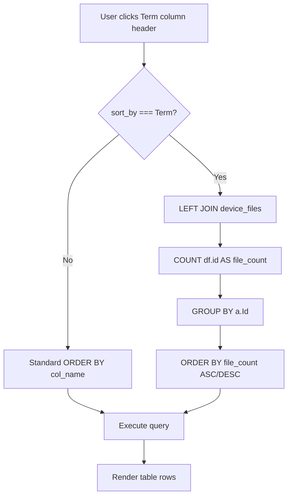
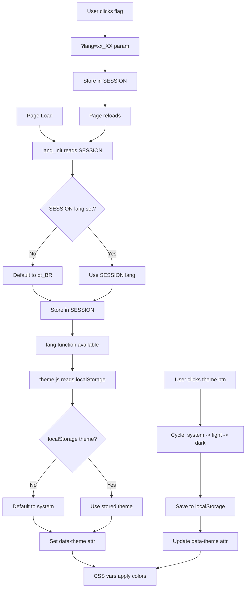

# Plan: Multi-Language, Theme Toggle & Term Sort Fix

## Overview

This plan addresses three requirements in the CMDB system:

1. **Fix the `Term` column sort** — `Term` is a computed display column (file count from `device_files`), not a real DB column
2. **Remove "Replaced" from Status options** — across all pages
3. **Multi-language support** — pt_BR (default), es_MX, en_US with flag-based switcher
4. **Theme toggle** — system/light/dark alongside the language flags

---

## Architecture & Design Decisions

### Language System

- A single file [`public/lang.php`](public/lang.php) holds all translation strings
- Language is stored in `$_SESSION['lang']`, defaulting to `pt_BR`
- A `lang()` helper function is used throughout all PHP pages
- Language is switched via `?lang=pt_BR|es_MX|en_US` query param, then stored in session
- Flag images from `https://flagcdn.com/w40/{code}.png`:
  - Brazil: `br` → `https://flagcdn.com/w40/br.png`
  - Mexico: `mx` → `https://flagcdn.com/w40/mx.png`
  - USA: `us` → `https://flagcdn.com/w40/us.png`

### Theme System

- Pure CSS custom properties approach — no JS framework needed
- Three modes: `system` (default, follows OS preference via `prefers-color-scheme`), `light`, `dark`
- A small JS file [`public/theme.js`](public/theme.js) handles:
  - Reading/writing theme preference to `localStorage`
  - Setting `data-theme` attribute on `<html>` element
  - Detecting OS preference for `system` mode
- CSS in [`public/style.css`](public/style.css) defines `:root` (light), `[data-theme="dark"]` (dark), and `@media (prefers-color-scheme: dark)` for system mode

### Language/Theme UI Placement

Per the user's requirement, the language flags and theme toggle button sit **in the top-right corner** of every page, as a compact toolbar.

```
┌─────────────────────────────────────────────────────────────────┐
│ CMDB Company: XYZ                          🇧🇷  🇲🇽  🇺🇸  ☀️/🌙 │
└─────────────────────────────────────────────────────────────────┘
```

---

## File-by-File Changes

### 1. NEW: [`public/lang.php`](public/lang.php)

Translation helper with three languages. Key strings include:

| Key              | pt_BR                          | es_MX                        | en_US                        |
|------------------|--------------------------------|------------------------------|------------------------------|
| `title_cmdb`     | CMDB Empresa:                  | CMDB Empresa:                | CMDB Company:                |
| `signed_in_as`   | Logado como:                   | Conectado como:              | Signed in as:                |
| `search_field`   | Campo de Busca                 | Campo de Búsqueda            | Search Field                 |
| `search_text`    | Texto de Busca                 | Texto de Búsqueda            | Search Text                  |
| `search`         | Buscar                         | Buscar                       | Search                       |
| `clear`          | Limpar                         | Limpiar                      | Clear                        |
| `export`         | Exportar para Excel            | Exportar a Excel             | Export to Excel              |
| `manage_perm`    | Gerenciar Permissões           | Gestionar Permisos           | Manage Permissions           |
| `logout`         | Sair                           | Cerrar Sesión                | Logout                       |
| `save_changes`   | Salvar Alterações              | Guardar Cambios              | Save Changes                 |
| `previous`       | Anterior                       | Anterior                     | Previous                     |
| `next`           | Próximo                        | Siguiente                     | Next                         |
| `page`           | Página                         | Página                       | Page                         |
| `of`             | de                             | de                           | of                            |
| `showing`        | Mostrando                      | Mostrando                    | Showing                      |
| `to`             | até                            | a                            | to                           |
| `records`        | registros                      | registros                    | records                      |
| `select_field`   | Selecionar campo               | Seleccionar campo            | Select field                 |
| `back`           | Voltar para CMDB               | Volver a CMDB                | Back to CMDB                 |
| `details`        | Detalhes                       | Detalles                     | Details                      |
| `upload`         | Enviar Novo Arquivo            | Subir Nuevo Archivo          | Upload New File              |
| `existing_files` | Arquivos Existentes            | Archivos Existentes          | Existing Files               |
| `no_files`       | Nenhum arquivo encontrado      | No se encontraron archivos   | No files found               |
| `delete`         | Excluir                        | Eliminar                     | Delete                        |
| `confirm_delete` | Excluir este arquivo?          | ¿Eliminar este archivo?      | Delete this file?            |
| `no_files_term`  | Sem arquivos                   | Sin archivos                 | No files                      |
| `file`           | arquivo                        | archivo                      | file                         |
| `files`          | arquivos                       | archivos                     | files                        |
| `login_title`    | CMDB - Login                   | CMDB - Iniciar Sesión        | CMDB - Login                 |
| `login_prompt`   | Faça login com sua conta       | Inicie sesión con su cuenta  | Please sign in using your company account |
| `sso_btn`        | Entrar com SSO                 | Iniciar sesión con SSO       | Sign in with SSO             |
| `status_in_use`  | Em Uso                         | En Uso                       | In Use                       |
| `status_stock`   | Em Estoque                     | En Stock                     | In Stock                     |
| `status_repair`  | Em Reparo                      | En Reparación                | In Repair                    |
| `status_decomm`  | Descomissionado                | Retirado                     | Decommissioned               |
| `status_lost`    | Perdido ou Roubado             | Perdido o Robado             | Lost or Stolen               |
| `perm_title`     | Gerenciamento de Permissões    | Gestión de Permisos          | Permission Management        |
| `perm_grant`     | Conceder Permissões            | Conceder Permisos            | Grant Permissions            |
| `perm_current`   | Administradores Atuais         | Administradores Actuales     | Current Admins               |
| `perm_back`      | Voltar ao Painel               | Volver al Panel              | Back to Dashboard            |
| `theme_system`   | Sistema                        | Sistema                      | System                       |
| `theme_light`    | Claro                          | Claro                        | Light                        |
| `theme_dark`     | Escuro                         | Oscuro                       | Dark                         |

The file provides:
```php
function lang_init() { /* reads session, sets default */ }
function lang($key) { /* returns translated string */ }
function lang_flag_buttons($current_page) { /* returns HTML for flag icons */ }
```

### 2. NEW: [`public/theme.js`](public/theme.js)

```javascript
// Theme management
// - Reads theme from localStorage (default: 'system')
// - Applies data-theme attribute to <html>
// - Listens for OS theme changes in 'system' mode
// - Provides cycleTheme() for the toggle button
```

The toggle button cycles: system → light → dark → system...

### 3. MODIFY: [`public/style.css`](public/style.css)

Add CSS custom properties at the top:

```css
:root {
    --bg: #fafafa;
    --text: #333;
    --heading: #222;
    --table-bg: #fff;
    --table-header-bg: #f5f7fa;
    --table-header-text: #555;
    --table-border: #ddd;
    --table-stripe: #f9f9f9;
    --link: #3b82f6;
    --btn-primary: #3b82f6;
    --btn-primary-hover: #2563eb;
    --btn-danger: #ef4444;
    --btn-danger-hover: #b91c1c;
    --input-border: #ccc;
    --shadow: 0 0 10px rgba(0,0,0,0.1);
    --toolbar-bg: #f0f0f0;
    /* ... etc */
}

[data-theme="dark"] {
    --bg: #1a1a2e;
    --text: #e0e0e0;
    --heading: #ffffff;
    --table-bg: #16213e;
    --table-header-bg: #0f3460;
    /* ... */
}
```

Then replace all hardcoded colors in existing rules with `var(--*)` references.

### 4. MODIFY: [`public/main.php`](public/main.php) — Core Fixes

#### 4a. Term Sort Fix (the root bug)

The problem is on line 130: when `$sort_by === 'Term'`, the SQL does `ORDER BY \`Term\`` but `Term` is not a column in `assets`.

**Solution**: When sorting by `Term`, use a LEFT JOIN with a COUNT subquery:

```php
// In the SELECT query (around line 142):
if ($sort_by === 'Term') {
    $sql = "SELECT a.*, COUNT(df.id) AS file_count 
            FROM `$userTableName` a 
            LEFT JOIN device_files df ON df.device_id = a.Id AND df.device_table = 'assets'
            $whereSql 
            GROUP BY a.Id 
            ORDER BY file_count " . ($sort_dir === 'desc' ? 'DESC' : 'ASC') . " 
            $limitSql";
} else {
    $sql = "SELECT * FROM `$userTableName` $whereSql $orderSql $limitSql";
}
```

Also update the `$countSql` to match when sorting by Term to maintain accurate pagination.

The `$orderSql` building logic (lines 129-135) must also skip adding an ORDER BY when `$sort_by === 'Term'` since the ORDER BY is embedded in the JOIN query.

#### 4b. Remove "Replaced" from Status

Change line 78:
```php
// Before:
$status_options = ["In Use","In Stock","In Repair","Replaced","Decommissioned","Lost or Stolen"];
// After:
$status_options = ["In Use","In Stock","In Repair","Decommissioned","Lost or Stolen"];
```

#### 4c. Language & Theme Integration

- Add `require_once 'lang.php';` at top
- Add `lang_init();` after session_start()
- Replace all hardcoded English strings with `<?php echo lang('key'); ?>`
- Add `<?php echo lang_flag_buttons('main.php'); ?>` and theme toggle in the top-right header area
- Include `<script src="theme.js"></script>` before `</body>`

### 5. MODIFY: [`public/export.php`](public/export.php)

Same Term sort fix as main.php (lines 117-122, 125):
```php
if ($sort_by === 'Term') {
    $sql = "SELECT a.*, COUNT(df.id) AS file_count 
            FROM `$userTableName` a 
            LEFT JOIN device_files df ON df.device_id = a.Id AND df.device_table = 'assets'
            $whereSql 
            GROUP BY a.Id 
            ORDER BY file_count " . ($sort_dir === 'desc' ? 'DESC' : 'ASC');
} else {
    $sql = "SELECT * FROM `$userTableName` $whereSql $orderSql";
}
```

### 6. MODIFY: [`public/asset.php`](public/asset.php)

- Add `require_once 'lang.php';` and `lang_init();`
- Remove "Replaced" from `$status_options` on line 254
- Replace hardcoded strings with `lang()` calls
- Add language flags + theme toggle in header
- Include `theme.js`

### 7. MODIFY: [`public/index.php`](public/index.php)

- Add `require_once 'lang.php';` and `lang_init();`
- Replace hardcoded strings with `lang()` calls
- Add language flags + theme toggle
- Include `theme.js`

### 8. MODIFY: [`public/manage_permissions.php`](public/manage_permissions.php)

- Add `require_once 'lang.php';` and `lang_init();`
- Replace hardcoded strings with `lang()` calls
- Add language flags + theme toggle
- Include `theme.js`

---

## Summary of All Changes

| File | Action | Summary |
|------|--------|---------|
| [`public/lang.php`](public/lang.php) | **CREATE** | Translation system: pt_BR, es_MX, en_US |
| [`public/theme.js`](public/theme.js) | **CREATE** | Theme toggle JS (system/light/dark) |
| [`public/style.css`](public/style.css) | **MODIFY** | Add CSS custom properties for theming |
| [`public/main.php`](public/main.php) | **MODIFY** | Term sort via JOIN, remove Replaced, i18n + theme |
| [`public/export.php`](public/export.php) | **MODIFY** | Term sort via JOIN |
| [`public/asset.php`](public/asset.php) | **MODIFY** | Remove Replaced, i18n + theme |
| [`public/index.php`](public/index.php) | **MODIFY** | i18n + theme |
| [`public/manage_permissions.php`](public/manage_permissions.php) | **MODIFY** | i18n + theme |

---

## Mermaid: Term Sort Fix Flow



---

## Mermaid: Language & Theme Flow


